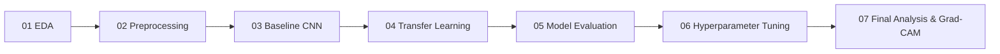

# PneumoVision_AI

> **Deteksi dini pneumonia berbasis deep learning dari citra sinar-X dada (Chest X-Ray).**

[](https://www.python.org/)
[](https://pytorch.org/)
[](https://fastapi.tiangolo.com/)
[](https://vitejs.dev/)
[](LICENSE)

---

## ⚠️ Disclaimer Medis

> **PENTING UNTUK DIPERHATIKAN**  
> **Proyek ini dibuat murni untuk tujuan edukasi, riset, dan portofolio, serta BUKAN merupakan alat diagnosis medis resmi.**  
> PneumoVision_AI dirancang sebagai studi kasus penerapan deep learning dan computer vision di bidang medis. Sistem ini **tidak** memberikan diagnosis medis klinis yang definitif, tidak disetujui oleh instansi kesehatan (seperti Kemenkes, FDA, atau WHO), dan **tidak boleh** digunakan untuk menggantikan pertimbangan, diagnosis, ataupun saran medis dari dokter spesialis radiologi atau tenaga medis profesional.

---

## 📌 Gambaran Umum (Overview)

Pneumonia adalah salah satu infeksi saluran pernapasan akut yang paling berbahaya di dunia, terutama pada anak-anak dan lansia. Salah satu pemeriksaan utama yang cepat dan umum digunakan untuk mendeteksi pneumonia adalah foto rontgen dada (Chest X-Ray).

Namun, membaca rontgen dada tidak selalu mudah. Perlu dokter radiologi berpengalaman untuk membedakan antara paru-paru yang sehat dengan bercak infeksi (infiltrat/konsolidasi) yang samar. Di banyak daerah, ketersediaan dokter spesialis radiologi masih sangat terbatas.

**PneumoVision_AI** hadir sebagai proyek portofolio AI end-to-end yang bertujuan mengklasifikasikan foto rontgen dada ke dalam dua kelas:
- **NORMAL**: Paru-paru bersih dan sehat tanpa tanda-tanda infeksi aktif.
- **PNEUMONIA**: Terdapat indikasi infeksi paru-paru (seperti bercak putih/konsolidasi).

Proyek ini tidak hanya berfokus pada melatih model, tetapi juga menerapkan praktik machine learning yang baik, interpretabilitas model dengan Explainable AI (Grad-CAM), arsitektur modular yang rapi, serta aplikasi web yang siap pakai.

---

## 🎯 Rumusan Masalah (Problem Statement)

Mengembangkan AI untuk citra medis punya tantangan unik yang berbeda dari dataset umum seperti kucing vs anjing:
1. **Pola Visual yang Samar**: Bercak pneumonia bisa sangat tipis, menyebar (interstitial), atau menggumpal di satu lobus paru (focal consolidation).
2. **Kualitas & Variasi Foto**: Foto rontgen diambil dengan mesin yang berbeda, sudut rotasi pasien yang berbeda, serta tingkat kontras yang beragam.
3. **Masalah "Black-Box"**: Dokter tidak akan percaya pada prediksi AI jika model hanya mengeluarkan label tanpa alasan visual yang jelas. Kita wajib menyediakan penjelasan visual area paru mana yang dicurigai.

---

## 🚀 Tujuan Proyek (Objectives)

- **Eksplorasi Data yang Teliti**: Memahami dataset secara mendalam lewat Exploratory Data Analysis (EDA), memeriksa resolusi gambar, rasio kelas, dan memastikan tidak ada data leakage antar split.
- **Eksperimen Bertahap & Terukur**: Membangun model Baseline CNN sederhana terlebih dahulu, kemudian menguji Transfer Learning (ResNet, DenseNet, EfficientNet) untuk melihat mana yang performanya paling konsisten.
- **Explainable AI (Grad-CAM)**: Menghasilkan visualisasi heatmap yang memperlihatkan area paru-paru mana yang memicu model mengambil keputusan.
- **Pemisahan Modul yang Rapi**: Memisahkan kode riset/training (`notebooks/` & `src/`), backend API (`backend/`), dan frontend (`frontend/`) agar mudah dikembangkan dan di-maintain.
- **Dua Mode Aplikasi**: Mendukung **Demo Mode** (langsung jalan di browser dengan 4 sampel kurasi tanpa perlu GPU/backend) dan **Live AI Mode** (upload gambar bebas via FastAPI backend).

---

## 📂 Dataset

Dataset yang digunakan adalah kumpulan foto rontgen dada yang sudah terbagi ke dalam folder standar:

```
XRayData/
└── chest_xray/
    ├── train/
    │   ├── NORMAL/
    │   └── PNEUMONIA/
    ├── val/
    │   ├── NORMAL/
    │   └── PNEUMONIA/
    └── test/
        ├── NORMAL/
        └── PNEUMONIA/
```

- **Aturan Dataset**: Folder `XRayData/` adalah data mentah yang tidak diubah dan tidak di-commit ke Git (`.gitignore`) demi menjaga kebersihan repository.
- **Audit Data**: Seluruh statistik jumlah gambar, dimensi, rasio perbandingan kelas, serta pengecekan duplikasi akan dianalisis secara transparan di notebook `01_EDA.ipynb`.

---

## 🧠 Alur Machine Learning (ML Pipeline)

Pengembangan model deep learning dilakukan bertahap lewat 7 langkah sistematis:



1. **01 EDA**: Memahami karakteristik gambar, cek apakah data seimbang atau timpang (class imbalance), cek resolusi, dan pastikan tidak ada kebocoran data (data leakage).
2. **02 Preprocessing**: Menyiapkan pipeline resize, normalisasi tensor, dan teknik data augmentation yang aman untuk citra medis (rotasi halus, flip horizontal, dsb.).
3. **03 Baseline Model**: Membuat arsitektur CNN sederhana dari nol menggunakan PyTorch sebagai standar pembanding awal.
4. **04 Transfer Learning**: Menguji beberapa arsitektur pretrained populer (seperti ResNet, DenseNet, EfficientNet) secara objektif tanpa berasumsi satu model langsung paling unggul.
5. **05 Model Evaluation**: Menghitung metrik penting dengan fokus khusus pada Recall/Sensitivity (karena di dunia medis, melewatkan pasien sakit / False Negative jauh lebih berbahaya dibanding False Positive).
6. **06 Hyperparameter Tuning**: Mencari kombinasi Learning Rate, Optimizer, Scheduler, Batch Size, dan Dropout terbaik untuk mencegah Overfitting.
7. **07 Final Model Analysis**: Memilih model terbaik berdasarkan data validasi, mengujinya di data test akhir, menghasilkan visualisasi Grad-CAM, dan mengekspor bobot model untuk backend.

---

## 🏗️ Arsitektur Proyek

Struktur folder dirancang dengan prinsip pemisahan tanggung jawab (separation of concerns):

```
PneumoVision_AI/
│
├── XRayData/                        # Dataset sumber (tidak di-commit ke Git)
│   └── chest_xray/
│       ├── train/
│       ├── val/
│       └── test/
│
├── notebooks/                       # Alur eksperimen & riset bertahap
│   ├── 01_EDA.ipynb                 # Analisis eksplorasi data
│   ├── 02_Preprocessing.ipynb       # Pipeline data & augmentasi
│   ├── 03_Baseline_Model.ipynb      # Eksperimen model CNN dasar
│   ├── 04_Transfer_Learning.ipynb   # Eksperimen Transfer Learning
│   ├── 05_Model_Evaluation.ipynb    # Evaluasi metrik & perbandingan
│   ├── 06_Hyperparameter_Tuning.ipynb# Tuning hyperparameter & regularisasi
│   └── 07_Final_Model_Analysis.ipynb# Evaluasi test set & Grad-CAM
│
├── src/                             # Modul Python modular yang reusable
│   ├── data/                        # Dataset class & DataLoader builder
│   ├── models/                      # Definisi arsitektur & backbone
│   ├── training/                    # Training loop, loss, & checkpointing
│   ├── evaluation/                  # Fungsi kalkulasi metrik & confusion matrix
│   ├── explainability/              # Implementasi Grad-CAM & overlay heatmap
│   └── utils/                       # Reproducibility seed & device helper
│
├── models/                          # Tempat penyimpanan bobot model
│   ├── checkpoints/                 # Checkpoint selama training (.pth)
│   └── README.md                    # Dokumentasi cara load model
│
├── results/                         # Output visual & metrik eksperimen
│   ├── figures/                     # Grafik loss & akurasi
│   ├── metrics/                     # Laporan metrik (JSON/CSV)
│   ├── confusion_matrix/            # Plot visual confusion matrix
│   └── gradcam/                     # Hasil visualisasi heatmap Grad-CAM
│
├── demo/                            # Aset demo mandiri (tanpa backend)
│   ├── samples/                     # 4 sampel X-Ray kurasi (2 Normal, 2 Pneumonia)
│   └── results/                     # Payload JSON hasil inferensi siap pakai
│
├── backend/                         # Layanan API berbasis FastAPI
│   ├── app/
│   │   ├── routes/                  # Endpoint API (/health, /predict, /explain)
│   │   ├── services/                # Logika inferensi PyTorch & Grad-CAM
│   │   ├── schemas/                 # Pydantic schema request/response
│   │   └── utils/                   # Helper konversi gambar & tensor
│   ├── requirements.txt             # Dependensi khusus backend
│   └── README.md                    # Panduan menjalankan backend
│
├── frontend/                        # Aplikasi web berbasis React + Vite
│   └── README.md                    # Panduan frontend & rancangan UI
│
├── docs/                            # Dokumentasi pendukung proyek
│   ├── architecture/                # Diagram alur sistem
│   ├── model/                       # Dokumentasi arsitektur model
│   └── screenshots/                 # Tangkapan layar antarmuka aplikasi
│
├── requirements.txt                 # Dependensi utama ML & Data Science
├── .gitignore                       # Aturan pengecualian file Git
├── README.md                        # Dokumentasi utama proyek
└── LICENSE                          # Lisensi open-source MIT
```

---

## 🗺️ Roadmap Pengembangan

- [x] **Tahap 1: Setup Arsitektur & Scaffolding Proyek**
  - Membuat struktur folder modular, `.gitignore`, lisensi, dan `requirements.txt`.
  - Menginisialisasi 7 file Jupyter notebook berurutan.
  - Menyiapkan dokumentasi komprehensif dalam Bahasa Indonesia.
- [x] **Tahap 2: Exploratory Data Analysis (`01_EDA.ipynb`)**
  - Analisis distribusi kelas pada data train, val, dan test.
  - Profiling ukuran gambar, rasio aspek, dan mode warna.
  - Cek kualitas data dan verifikasi tidak adanya data leakage.
- [x] **Tahap 3: Pipeline Preprocessing (`02_Preprocessing.ipynb`)**
  - Pembuatan PyTorch `Dataset` dan `DataLoader`.
  - Pembuatan stratified split baru (Train 4.172, Val 1.044, Test 624 terkunci).
  - Perancangan teknik augmentasi citra yang realistis secara medis.
- [x] **Tahap 4: Pembuatan Baseline Model (`03_Baseline_Model.ipynb`)**
  - Melatih model CNN custom sederhana dari nol (~40k parameter) dengan Class Weighting.
  - Menetapkan batas bawah performa benchmark (Accuracy: 76,28%, Recall: 98,72% pada Pneumonia).
- [x] **Tahap 5: Eksperimen Transfer Learning (`04_Transfer_Learning.ipynb`)**
  - Melatih pretrained ResNet18 dengan bobot ImageNet di bawah kondisi data dan class weights yang setara.
  - Membuktikan peningkatan generalisasi: Akurasi Test Set 83,33% (+7,05%), F1 Macro 80,02% (+10,51%), Specificity Normal 56,84% (+17,95%), dan Recall Pneumonia tetap unggul pada 99,23%.
- [ ] **Tahap 6: Evaluasi Model Menyeluruh (`05_Model_Evaluation.ipynb`)**
  - Analisis Precision, Recall, F1-Score, ROC-AUC, dan Confusion Matrix.
- [ ] **Tahap 7: Hyperparameter Tuning (`06_Hyperparameter_Tuning.ipynb`)**
  - Optimasi Learning Rate, Scheduler, Dropout, dan Weight Decay.
- [ ] **Tahap 8: Analisis Model Final & Grad-CAM (`07_Final_Model_Analysis.ipynb`)**
  - Pemilihan model terbaik, evaluasi data test final, dan visualisasi Grad-CAM.
- [ ] **Tahap 9: Kurasi Aset Demo Mode**
  - Memilih 4 sampel rontgen dan menyiapkan JSON hasil inferensi siap saji.
- [ ] **Tahap 10: Pembuatan FastAPI Backend**
  - Membangun endpoint `/predict`, `/explain`, dan `/health`.
- [ ] **Tahap 11: Pembuatan Web UI React + Vite**
  - Merancang antarmuka yang modern, bersih, responsif, dan mudah digunakan.

---

## 💻 Teknologi yang Digunakan

| Komponen | Teknologi |
|---|---|
| **Bahasa Pemrograman** | Python 3.10+, JavaScript / JSX |
| **Deep Learning & Modeling** | PyTorch, Torchvision |
| **Pengolahan Data & Numerik** | NumPy, Pandas, Scikit-learn, SciPy |
| **Computer Vision & XAI** | OpenCV, Pillow, PyTorch Hooks (Grad-CAM) |
| **Visualisasi Data** | Matplotlib, Seaborn |
| **Lingkungan Eksperimen** | Jupyter Notebook / JupyterLab |
| **Backend API** | FastAPI, Uvicorn, Pydantic |
| **Frontend Web** | React, Vite, Vanilla CSS |

---

## 🖥️ Mode Demo vs Live AI

PneumoVision_AI menyediakan dua mode interaksi:

1. **Demo Mode (Tanpa Backend)**:
   - Menggunakan **4 sampel rontgen terkurasi** (2 NORMAL dan 2 PNEUMONIA).
   - Seluruh hasil prediksi, skor confidence, dan visualisasi Grad-CAM sudah dihitung sebelumnya (precomputed JSON).
   - Pengunjung bisa langsung mencoba aplikasi di hosting statis (Vercel/Netlify/GitHub Pages) tanpa perlu server aktif atau GPU.

2. **Live AI Mode**:
   - Pengguna dapat mengunggah file rontgen dada sendiri.
   - Frontend akan mengirim gambar ke FastAPI backend untuk diproses secara real-time oleh model PyTorch dan menghasilkan heatmap Grad-CAM secara langsung.

---

## 📊 Evaluasi Model

Tabel evaluasi diperbarui secara berkala berdasarkan hasil eksperimen aktual pada locked hold-out test set (624 sampel):

| Arsitektur Model | Accuracy | Precision (Macro) | Recall (Pneumonia) | Specificity (Normal) | F1-Score (Macro) | Checkpoint |
|---|---|---|---|---|---|---|
| **Baseline CNN (From Scratch)** | **76.28%** | **83.85%** | **98.72%** | **38.89%** | **69.51%** | [`baseline_cnn_best.pth`](models/checkpoints/baseline_cnn_best.pth) |
| **ResNet18 (Transfer Learning)** | **83.33%** | **88.55%** | **99.23%** | **56.84%** | **80.02%** | [`resnet18_transfer_best.pth`](models/checkpoints/resnet18_transfer_best.pth) |
| *DenseNet Benchmark* | *Hasil akan diuji pada tahap evaluasi berikutnya.* | *—* | *—* | *—* | *—* | *—* |
| *EfficientNet Benchmark* | *Hasil akan diuji pada tahap evaluasi berikutnya.* | *—* | *—* | *—* | *—* | *—* |
| **Model Terbaik Terpilih** | *Akan ditentukan setelah evaluasi komparatif multi-model.* | *—* | *—* | *—* | *—* | *—* |

> *Catatan: Nilai metrik di atas diperoleh dari evaluasi aktual hold-out test set (624 sampel) di notebook `03_Baseline_Model.ipynb` dan `04_Transfer_Learning.ipynb`. Tidak ada angka perkiraan atau rekayasa.*

> *Catatan: Demi menjaga integritas ilmiah dan standar portofolio, tidak ada angka metrik buatan atau dummy yang dicantumkan. Semua nilai akan murni diisi dari hasil evaluasi data test di notebook `07_Final_Model_Analysis.ipynb`.*

---

## 🔍 Explainable AI (Grad-CAM)

Dalam penerapan AI medis, kita tidak boleh percaya begitu saja pada akurasi tinggi jika tidak tahu alasan di baliknya. Bisa saja model mendapat akurasi bagus karena mengenali tanda teknis pada mesin rontgen (seperti teks 'R' atau 'L') alih-alih kondisi paru-paru pasien (kondisi yang dikenal sebagai *Clever Hans effect*).

Oleh karena itu, kami menerapkan **Grad-CAM (Gradient-weighted Class Activation Mapping)**:
- Mengambil gradien kelas target pada layer konvolusi terakhir.
- Menghasilkan peta panas (heatmap) berwarna yang menunjukkan area spesifik yang menjadi fokus utama perhatian model.
- Menumpuk (overlay) heatmap tersebut ke atas foto rontgen asli dengan transparansi interaktif.

*Contoh visualisasi Grad-CAM akan ditambahkan setelah model selesai dilatih.*

---

## ⚠️ Batasan Sistem (Limitations)

- **Klasifikasi Biner**: Model ini hanya membedakan kategori NORMAL vs PNEUMONIA, dan belum membedakan penyebab spesifik (apakah pneumonia akibat bakteri atau virus) maupun kelainan paru lainnya (seperti TBC, efusi pleura, atau pneumotoraks).
- **Variasi Mesin Rontgen**: Perbedaan jenis mesin, dosis radiasi, dan posisi pasien (AP vs PA) pada fasilitas kesehatan yang berbeda dapat memengaruhi performa model.
- **Karakteristik Usia**: Struktur anatomi dada anak-anak berbeda secara signifikan dengan orang dewasa (misalnya bayangan kelenjar timus pada anak yang sering menyerupai konsolidasi).

---

## 📄 Lisensi

Proyek ini dirilis di bawah lisensi terbuka [MIT License](LICENSE).
